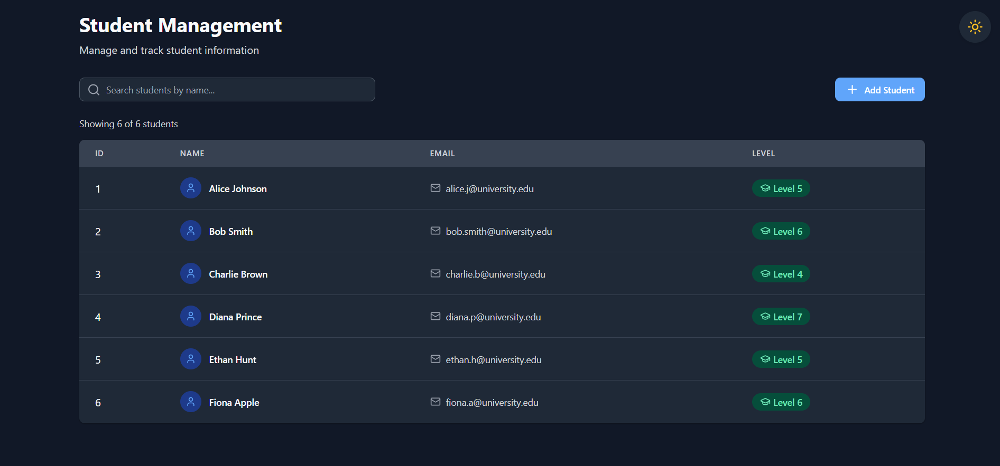

# 🎓 Student Management System

A modern, responsive Student Management UI built with **React**, **TypeScript**, and **Vite**. Features a beautiful dark/light mode toggle and intuitive interface for managing student records.

## 🎥 Project Demo Video

[](https://youtu.be/KtDHrdusSk4)

## ✨ Features

- 📋 **Student List View** - Display all students in a clean, organized table
- 🔍 **Real-time Search** - Filter students by name as you type
- ➕ **Add New Students** - Modal form with validation for adding new records
- ✅ **Form Validation** - Email format validation and required field checks
- 🌓 **Dark/Light Mode** - Beautiful theme toggle with smooth transitions
- 💾 **Theme Persistence** - Remembers your theme preference
- 🎨 **Modern UI** - Clean, responsive design with custom CSS
- 📱 **Mobile Responsive** - Works seamlessly on all device sizes
- 🚀 **Fast Performance** - Built with Vite for lightning-fast development

## 🖼️ Screenshots

### Light Mode
```
┌────────────────────────────────────────┐
│            Student Management     [🌙] │
│     Manage and track student info       │
│                                         │
│  [Search...] 🔍       [+ Add Student]  │
│                                        │
│  Showing 6 of 6 students               │
│  ┌───────────────────────────────────┐ │
│  │ ID │ Name    │ Email    │ Level   │ │
│  ├────┼─────────┼──────────┼──────── ┤ │
│  │ 1  │ Alice   │ alice@   │ Lvl 5   │ │
│  │ 2  │ Bob     │ bob@     │ Lvl 6   │ │
│  └───────────────────────────────────┘ │
└────────────────────────────────────────┘
```

### Dark Mode
```
┌─────────────────────────────────────────┐
│   🌙 Dark Mode Active                   │
│            Student Management     [☀️]  │
│     Manage and track student info       │
└─────────────────────────────────────────┘
```

## 🚀 Quick Start

### Prerequisites

- **Node.js** (v16 or higher)
- **npm** or **yarn**

### Installation

1. **Clone the repository**
```bash
git clone https://github.com/yourusername/student-management.git
cd student-management
```

2. **Install dependencies**
```bash
npm install
```

3. **Run the development server**
```bash
npm run dev
```

4. **Open your browser**
```
http://localhost:5173
```

## 📁 Project Structure

```
student-management/
├── src/
│   ├── components/          # Reusable UI components
│   │   ├── SearchBar.tsx
│   │   ├── SearchBar.css
│   │   ├── StudentTable.tsx
│   │   ├── StudentTable.css
│   │   ├── CreateStudentModal.tsx
│   │   ├── CreateStudentModal.css
│   │   ├── ThemeToggle.tsx      # 🌓 New: Theme switcher
│   │   └── ThemeToggle.css
│   ├── pages/              # Page components
│   │   ├── StudentsPage.tsx
│   │   └── StudentsPage.css
│   ├── types/              # TypeScript type definitions
│   │   └── student.ts
│   ├── data/               # Mock data
│   │   └── students.ts
│   ├── App.tsx             # Main app component
│   ├── main.tsx            # Entry point
│   └── index.css           # Global styles with CSS variables
├── public/                 # Static assets
├── index.html              # HTML template
├── package.json            # Dependencies
├── tsconfig.json           # TypeScript configuration
├── vite.config.ts          # Vite configuration
└── README.md               # Project documentation
```

## 🛠️ Technologies Used

| Technology | Purpose |
|------------|---------|
| **React 18** | UI library for building component-based interfaces |
| **TypeScript** | Type-safe JavaScript for better development experience |
| **Vite** | Fast build tool and development server |
| **Lucide React** | Beautiful, consistent icon library |
| **CSS3 Variables** | Dynamic theming without CSS frameworks |
| **LocalStorage API** | Theme preference persistence |

## 📚 Component Architecture

### Student Interface
```typescript
interface Student {
  id: number;
  name: string;
  email: string;
  level: 4 | 5 | 6 | 7;
}
```

### Component Hierarchy
```
App
└── StudentsPage
    ├── ThemeToggle (🌓 Theme Switcher)
    ├── SearchBar
    ├── StudentTable
    └── CreateStudentModal
```

## 🔧 Available Scripts

| Command | Description |
|---------|-------------|
| `npm run dev` | Start development server |
| `npm run build` | Build for production |


## 📝 Features Breakdown

### 1. Dark/Light Mode Toggle 🌓
- **System preference detection** - Automatically uses your OS theme
- **Manual toggle** - Sun/Moon button in top-right corner
- **Smooth transitions** - All colors animate smoothly
- **Persistent preference** - Saves to localStorage
- **CSS Variables** - Easy to customize colors

### 2. Search Functionality
- **Real-time filtering** as you type
- **Case-insensitive** search
- Searches through student names
- Shows filtered count

### 3. Add Student Modal
- **Form validation** for all fields
- **Email format validation** using regex
- **Required field checks** before submission
- **Auto-generated IDs** for new students
- **Form reset** after successful submission

### 4. Student Table
- **Responsive design** for mobile and desktop
- **Hover effects** on table rows
- **Empty state** when no students found
- **Icon indicators** for better UX
- **Color-coded levels** for quick identification

## 🎨 Theme Customization

### Light Mode Colors
```css
:root {
  --bg-primary: #f3f4f6;      /* Page background */
  --bg-secondary: #ffffff;     /* Card background */
  --text-primary: #111827;     /* Main text */
  --accent-primary: #3b82f6;   /* Buttons, links */
}
```

### Dark Mode Colors
```css
[data-theme="dark"] {
  --bg-primary: #111827;       /* Dark page background */
  --bg-secondary: #1f2937;     /* Dark card background */
  --text-primary: #f9fafb;     /* Light text */
  --accent-primary: #60a5fa;   /* Bright accent */
}
```

### Customize Your Theme
Edit `src/index.css` to change colors:
- Modify CSS variables in `:root` for light mode
- Modify `[data-theme="dark"]` for dark mode
- All components will automatically update!

## 🔐 Data Validation

### Email Validation
```typescript
const emailRegex = /^[^\s@]+@[^\s@]+\.[^\s@]+$/;
```

### Required Fields
- ✅ Name (required)
- ✅ Email (required + valid format)
- ✅ Level (required) ;

## 🚧 Future Enhancements

### Planned Features
- [ ] Edit student functionality
- [ ] Delete student functionality
- [ ] Sorting by columns (name, email, level)
- [ ] Export to CSV/Excel
- [ ] Backend API integration
- [ ] User authentication
- [ ] Student profile pages
- [ ] Advanced filtering options
- [ ] Custom theme colors picker
- [ ] Print-friendly view

### Theme Enhancements
- [ ] Auto dark mode based on time
- [ ] Multiple theme presets
- [ ] High contrast mode
- [ ] Color customization UI

## 📈 Performance

- ⚡ Lightning-fast Hot Module Replacement (HMR) with Vite
- 🎯 Optimized bundle size with tree-shaking
- 🔄 Efficient re-renders with React hooks
- 💾 Client-side state management (no external libraries)
- 🎨 CSS Variables for instant theme switching (no re-render)
- 🚀 Lazy loading ready for future enhancements

## 🎯 Browser Support

- ✅ Chrome (latest)
- ✅ Firefox (latest)
- ✅ Safari (latest)
- ✅ Edge (latest)
- ✅ Mobile browsers

## 🤝 Contributing

Contributions are welcome! Please follow these steps:

1. **Fork the repository**
2. **Create a feature branch**
   ```bash
   git checkout -b feature/amazing-feature
   ```
3. **Commit your changes**
   ```bash
   git commit -m 'Add some amazing feature'
   ```
4. **Push to the branch**
   ```bash
   git push origin feature/amazing-feature
   ```
5. **Open a Pull Request**

## 📄 License

This project is licensed under the **MIT License** - see the [LICENSE](LICENSE) file for details.

## 👨‍💻 Author

**Your Name**
- GitHub: [@jesu-ship-it](https://github.com/jesu-ship-it)
- Email: your.email@example.com

## 🙏 Acknowledgments

- [React Documentation](https://react.dev/)
- [TypeScript Documentation](https://www.typescriptlang.org/)
- [Vite Documentation](https://vitejs.dev/)
- [Lucide Icons](https://lucide.dev/)
- [CSS Variables Guide](https://developer.mozilla.org/en-US/docs/Web/CSS/Using_CSS_custom_properties)

## 💡 Learning Resources

If you want to learn more about the technologies used:
- **React Hooks**: [Official Guide](https://react.dev/reference/react)
- **TypeScript**: [Handbook](https://www.typescriptlang.org/docs/)
- **CSS Variables**: [MDN Guide](https://developer.mozilla.org/en-US/docs/Web/CSS/--*)
- **Dark Mode Best Practices**: [Web.dev](https://web.dev/prefers-color-scheme/)

## 🎓 Use Cases

Perfect for:
- Learning React + TypeScript
- School/University projects
- Portfolio demonstrations
- Internship assignments
- Frontend practice
- Theme implementation examples

---

## 🌟 Key Highlights

✨ **Zero Dependencies** for styling (no Bootstrap, Material-UI, etc.)  
🎨 **Custom CSS** with modern design patterns  
🌓 **Production-ready** dark mode implementation  
📱 **Fully Responsive** across all devices  
 

---

**Made with ❤️ using React + TypeScript + Vite**

⭐ Star this repo if you found it helpful!


---


**Last Updated**: November 2024  
**Version**: 1.0.0 (with Dark Mode 🌓)
